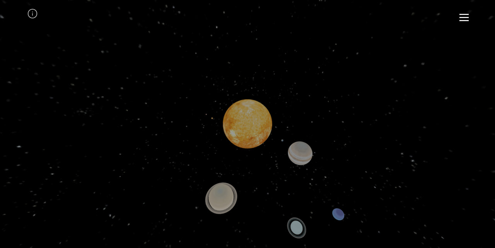
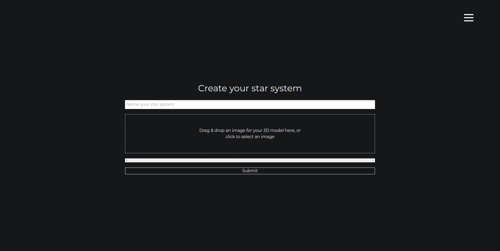
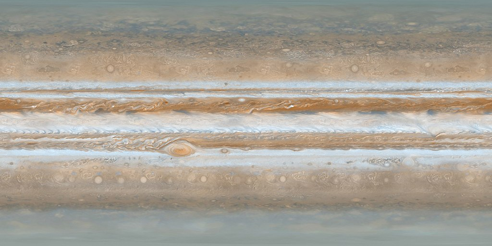
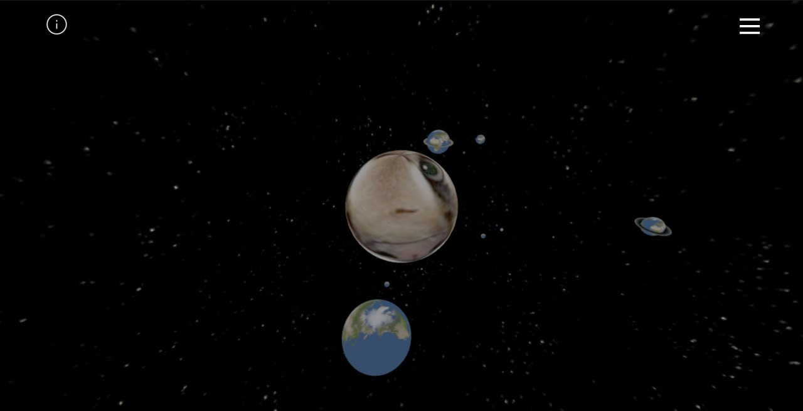

# Solar System Simulation Web Project

## <mark>Authors:</mark>
### <mark>[Dmytro Shumskyi](https://github.com/DmShums)</mark>
### <mark>[Oles'-Volodymyr Yarish](https://github.com/ParubokMotorniy)</mark>
### <mark>[Sviatoslav Stehnii](https://github.com/sviatkohuet)</mark>
### <mark>[Dmytro Khamula](https://github.com/hamuladm)</mark>

## Three.js
<mark>Three.js is a powerful and versatile JavaScript library used for creating and displaying animated 3D computer graphics in a web browser. It simplifies the process of developing 3D scenes, making it accessible even to developers who may not have a deep understanding of WebGL, the underlying graphics API. Three.js provides a wide range of features, including support for lights, cameras, materials, textures, and shaders, enabling the creation of visually stunning and interactive 3D experiences.

In our project, we utilized Three.js to simulate a solar system, taking advantage of its capabilities to render complex celestial bodies and their movements accurately. The library's ease of use allowed us to create realistic models of planets, moons, and other astronomical objects, complete with textures and lighting effects that mimic real-world observations. Three.js also facilitated the implementation of orbital mechanics, enabling us to animate the paths of planets around the sun and moons around their respective planets.
</mark>

## Instalation

<mark>`git clone https://github.com/DmShums/quat-rotator`</mark>

### Available Scripts

At first start React project

In the project directory, you can run:
#### npm install
#### npm start

After that start json server

### To start json server
cd data
npx json-server --watch db.json --port 3001

Runs the app in the development mode.\
Open [http://localhost:3000](http://localhost:3000) to view it in your browser.

The page will reload when you make changes.\
You may also see any lint errors in the console.

### Content of website

#### Welcome page
<mark>After proceeding to web brower you will see Solar System. You can rotate position of the camera by holding Left Muse Button, zoom in and out the system on Mouse Wheel.</mark>

#### Creating your own system

<mark>In Burger menu Section you will find 'Add System' link. On that page you can insert textures for creating your own system. You should give a name to the system too. Preferably formats of textures are .jpg, .png & other similar extensions. </mark>

<mark>Here's an example what texture of Jupiter used for Solar System</mark>

#### Example of custom System

